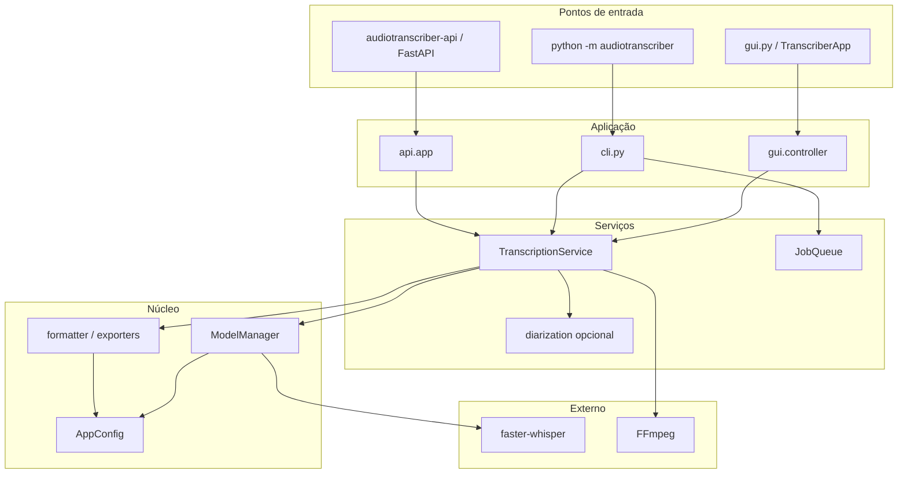
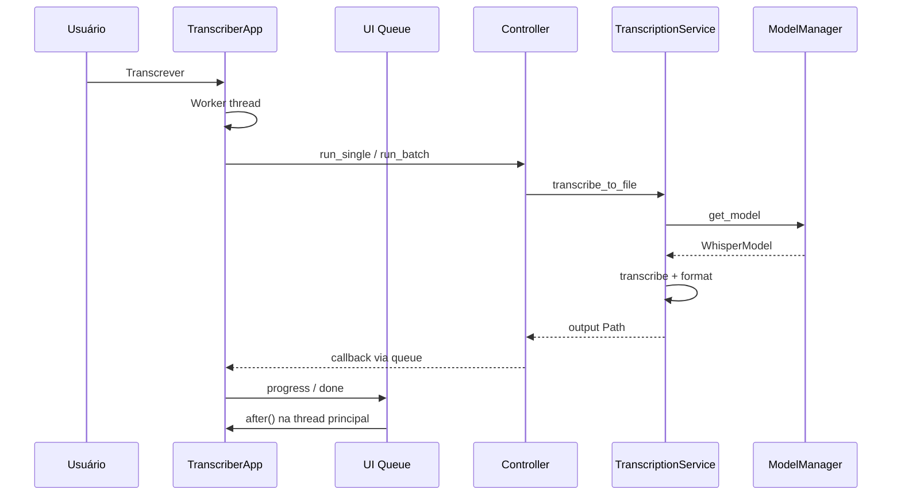

# Arquitetura — AudioTranscriber

Visão geral do pacote `src/audiotranscriber/` após a refatoração P0/P2.

## Camadas

## Fluxo de transcrição (GUI)

## ModelManager

- Cache de modelos por chave `(model_size, compute_type, device)`.
- `threading.Lock` para requisições concorrentes na API.
- Uma instância global via `get_model_manager()` (substitui singleton ad hoc).

## Configuração

| Fonte | Prioridade |
|-------|------------|
| Variáveis `WHISPER_*` | Mais alta |
| `config.yaml` na raiz do projeto | Média |
| Defaults em `AppConfig` | Mais baixa |

## Módulos

| Pacote | Responsabilidade |
|--------|------------------|
| `config/` | `AppConfig`, host API, CORS, rate limit |
| `core/` | Settings, formatter, exporters, FFmpeg, startup |
| `services/` | Transcrição, fila, diarização |
| `gui/` | Views tkinter, controller, app |
| `api/` | FastAPI, auth opcional |
| `cli.py` | `transcribe`, `batch`, `queue` |

## Deploy

| Modo | Artefato |
|------|----------|
| Desktop | `dist/AudioTranscriber/` (PyInstaller) |
| API local | `audiotranscriber-api` → `127.0.0.1:8000` |
| API Docker | `Dockerfile` → imagem headless |

Ver também: [PROJECT_LAYOUT.md](PROJECT_LAYOUT.md).
